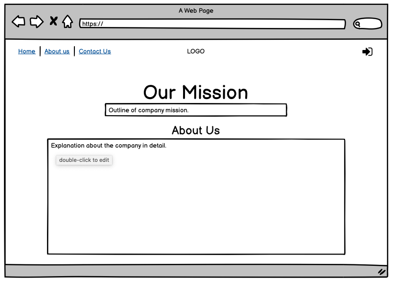

# All Natural Supplements

This is a website that is home to all natural supplements. The aim of the website is help you, the consumer, too better know the benefits of our products and to provide you with the most recent supplements. This website is made to be much more than a one stop site for your supplements. We, at All Natural Supplements are looking to build relationships with our customers for regular interaction between them and us. 

The website will contain and be kept updated with regular weekly discount codes for our new and existing members. This website will also allow you as a customer to join a wide spread All Natural Supplements community, where you will be able to interact with them one another as well as keep in contact with us about anything that you may want to inform us about. 

### User Experience (UX)

#### 1. User Stories:

##### **First time visitor goals.** 
- I would like to quickly understand what the website is selling or informing me about. 
- I would want the website to be easy to navigate around and have functional links that will take me to the correct product or the correct section. 

##### **Returning / Frequent visitor goals.**
- I want to be looking for more information on more products to try out. 
- I want to have my own account allowing me to add my desired products and keep an eye on my previous orders.
- I would like to find a community to connect with and see if there are any tips that other users found useful. 
- I would be looking for any added discounts or deals for returning business. 

##### **Business owner goals.**
Attract new customers as well as keeping the old customers happy. 
Provide the customers with as much detail as possible for the products on the website. 
Satisfy the customers with a number of different types of deals and offers to help promote the business and attract more customers. 
Have a visually appealing website and easy to operate by anyone and everyone. 

#### 2. Design: 

##### Colour Scheme -
The two colours that are prominent on this website are white and green. This is also displayed within the logo as well.

##### Typography -
The main font of the website is Poppins, regular 400 and semi-bold 600, throughout the whole website with Sans Serif as backup font if any issues occur. Poppins is easy to read and has various different styles to offer giving me a wide range of options to make the site as attractive and readable as possible. 

##### Imagery -
The main landing page image was taken from (https://www.biggreensmile.com/article/the-best-natural-supplements-for-winter.aspx) and the reason for choosing this particular image was that it combines the meaning behind the brand; the natural grain/nuts as supplements for your body.

#### 3. Wireframes:

Landing page wireframe - 

For the first main landing page I tried to keep it as close to the wireframe as shown in the picture above. However, during the process of building the landing page, the ideas changed and the landing page got better as you’ll see on the website. 

About us page wireframe - 
This is my About Us page for All Natural business and it has stayed the exact same as the wireframe when originally designed. 

Contact Us page wireframe - 
This was the original plan for the Contact Us page, but again like the landing page the design ended up changing slightly and that’s party because I wanted to go for a much cleaner and linear look to the website rather than it being cluttered. 

Sign Up page wireframe - 
This was the plan for the sign up page and this is exactly what was excicuted. 

### Features

##### Existing Features

- The first thing you come across on the website is the landing page with a Nav Bar. This allows you to effectively navigate around the website from any of the four pages. 

- The next feature that you’ll find are hyperlinks within the content. These allow you to go to a specific part of the website depending on which button you clicked.

- Next we have are external links for social media accounts. When clicked on the socials at the bottom of the page, a new tab will open, allowing the visitor to view the social media content but also allowing them to keep the initial website open for later use. 

- You will also find a couple of forms on my website. With very simple instructions. One of them is on the contact us page that allows you to fill in visitor’s details which will allow us to contact the visitor. And the second one is on the sign up page that allows the visitor to keep themselves up to date.

##### Features Left to Implement
- In the future with a little more knowledge about the backend development, I would like to add a few more pages to this website. 

- There will be a page for the online community to discuss their progresses or their diet plans, workout plans and such. 

- Another feature that I’d like to add is a page that will allow the visitor to browse the products and add them to the shopping basket. 

- Shopping basket is another feature that I would like to implement within this website to make it a lot more usable and user friendly.

#### Technologies Used

For this project I have used the two main languages used to create front end websites, HTML and CSS.

#### Frameworks, Libraries & Programs Used
- Google Fonts: I used Google Fonts to make sure that my website was exactly the way I wanted it to be.

- Font Awesome: I used Font Awesome to get my sign-up icon as well as my social media icons. 

- Git: I used Git to use the GitPod commit and to push my work onto GitHub.

- GitHub: This is where I stored all my work before and after I have finished it. 

- Bootstrap 4.4.1: I used bootstrap to take advantage of the quick and easy styling but also to make sure it was aesthetically pleasing. 

- jQuery: jQuery came with bootstrap that helped my made certain things more interactive than other. 

- Balsamiq: I used this program for the first time and learned how to now design my websites.

### Testing

I have been testing my code throughout the whole project. The two simple way of making sure that my code was working was by having the window open on the side and constantly checking the changes; as well as using the google chrome editor tool. I used that tool by having my preview window open in a new tab and right clicking on the webpage, then selecting inspect and going through the valid changed from there onwards. 

All the pages have also been check by the html and css validator and the results for that came back clear with no errors or warnings. 

[W3C Markup Validator] - (https://jigsaw.w3.org/css-validator/#validate_by_input)
[W3C CSS Validator] - (https://jigsaw.w3.org/css-validator/#validate_by_input)

#### Testing User Storied from UX:

##### First time visitor goals.

1. I would like to quickly understand what the website is selling or informing me about. 
- The visitor is welcomed with a soft background image website when entering for the first time. 
- The name of the company and the slogan is in the centre of the screen on top of the image, telling them what the business is about. 
Directly under it, there is more useful information on the services that the company provides.

2. I would want the website to be easy to navigate around and have functional links that will take me to the correct product or the correct section. 
- The navigation has been statically places on top of the website to make sure the use always has access to it.
- The links for external webpages open in a new tab so the visitor doesn’t loose the page they were previously on.

##### Returning / Frequent visitor goals.

1. I want to be looking for more information on more products to try out. 
- This can be found in the centre of the landing page and under the popular products section.

2. I want to have my own account allowing me to add my desired products and keep an eye on my previous orders.
- A working sign up page is available for the visitors to use. 

3. I would like to find a community to connect with and see if there are any tips that other users found useful. 
- There are social media accounts available for the visitors to view and join the community.

4. I would be looking for any added discounts or deals for returning business. 
- The discount codes are available for all customers.

##### Business owner goals.
1. Attract new customers as well as keeping the old customers happy. 
- The website is easy to use and has all the information a customer could want.

2. Provide the customers with as much detail as possible for the products on the website. 
- Product section provides a number of different details to help keep the customer informed about the business products.

3. Satisfy the customers with a number of different types of deals and offers to help promote the business and attract more customers. 
- There are deals and discounts on the landing page available for all the new and old customers. 

4. Have a visually appealing website and easy to operate by anyone and everyone. 
- The website is easy to operate and easy on the eye. 

### Credits

#### Content

For this project I wanted to create something from my imagination and not create a brand that already exists. Keeping that in mind, I came up with a few ideas for logos as well as the company names. In the end I decided to call the business All Natural Supplements with the logo being easy to create and easy to remember (AN). All of the information that you will be reading about the company is all fictional. 
The product information was taken from myprotein.com and the prices were altered according to my own will.  

#### Media

The media that you see on the website was all obtained from google images.

#### Acknowledgements
My inspiration for this project was from my previous studies done during my A-Levels as well as my love for natural nutrition. I would also like to thank everyone who helped me through this from the Slack groups, my mentor Can as well as the Student Support Team. 

##### Screen Shots:

##### Landing page 

##### About Us page

##### Contact Us page

##### Sign Up page

